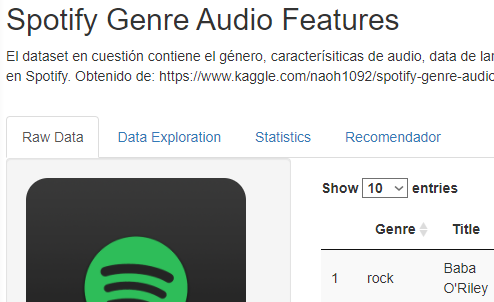
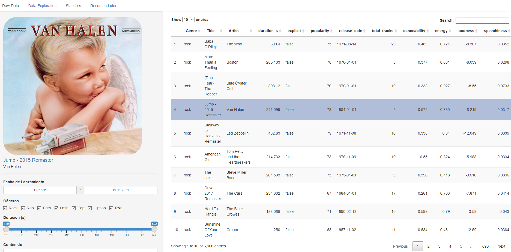
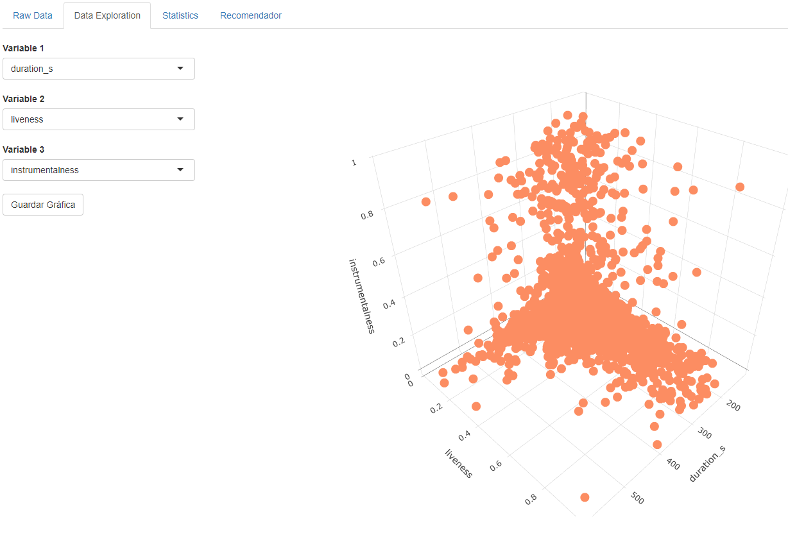
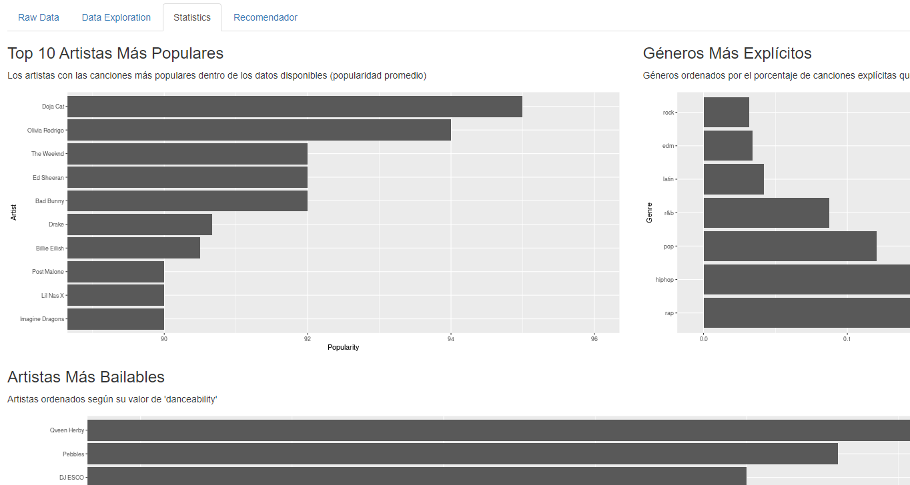
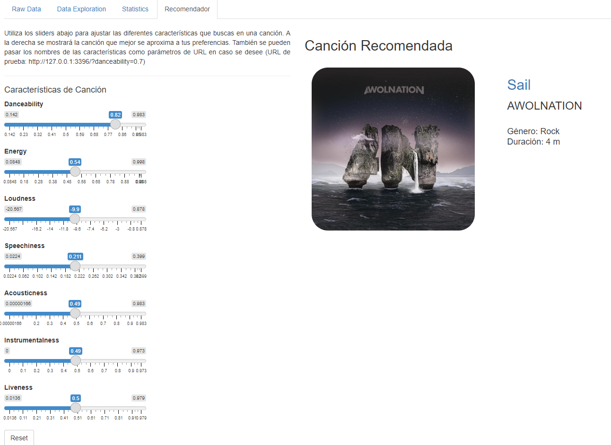

# Product Development - Proyecto 1 Dashboard: Spotify Genre Audio Features

## Dataset

El dataset utilizado contiene el género, título, artista, duración, caracterísiticas de audio, fecha de lanzamiento, id de Spotify y el link de portada de album para un total de 6917 canciones en Spotify. El mismo fue obtenido de [kaggle](https://www.kaggle.com/naoh1092/spotify-genre-audio-features) utilizando la API de Spotify y las técnicas de análisis propuestas por el siguiente [paper](https://www.researchgate.net/publication/305278539_Close_reading_big_data_The_Echo_Nest_and_the_production_of_rotten_music_metadata).

----

## Estructura

El dashboard creado está dividido en 4 pestañas: *Raw Data*, *Data Exploration*, *Statistics* y *Recomendador*. El mismo puede ser accesado en su forma en línea desde [shinyapps.io](https://eddysanoli.shinyapps.io/dashboard/) (**IMPORTANTE**: El botón de descarga de gráficos no funciona en el deployment en línea. Causa un crash).

### Raw Data

Esta ventana permite rápidamente ver las diferentes columnas con las que cuenta el dataset. Además de las opciones de filtrado y reordenado que ofrece el paquete *DT* por defecto, los datos también pueden ser filtrados según la fecha de lanzamiento de la canción, la duración de las canciones, la presencia de contenido explícito y los géneros incluidos (Los valores para dichos inputs son generados de manera dinámica en función de los datos disponibles). El usuario también puede seleccionar filas individuales de la tabla para así observar el arte del álbum de la canción, en conjunto con cierta información asociada del mismo (**NOTA**: Se puede hacer click en el título de la canción para ir a la canción dentro de Spotify).

### Data Exploration

Cuando se realizan tareas de Data Science, uno de los primeros pasos consiste en hacer gráficos de densidad y scatter plots. Para poder facilitar esto, esta pestaña permite al usuario graficar 1, 2 o 3 variables numéricas del dataset. Si solo se elige una variable, se grafica un gráfico de densidad. Si se eligen 2 o 3 variables, se genera un scatterplot en 2D o 3D respectiamente. Se pueden guardar los plots, pero solo cuando se emplea el deployment local. En línea genera un crash.

### Statistics

Aquí se incluyen 3 análisis de muestra para el dataset, incluyendo: Los 10 artistas más populares, un ranking de los géneros más 'explícitos' y los 10 artistas más bailables.

### Recomendador

Finalmente se encuentra el recomendador. El recomendador ofrece 7 sliders al usuario que describen diferentes características de una canción (danceability, energy, instrumentalness, acousticness, loudness, liveness y speechiness). El usuario puede variar que tan alto o bajo desea que sean estos valores y en función de los mismos, se genera una recomendación que se considera lo más cercana a las preferencias establecidas. El sistema de recomendación es simple: Se crea un vector con los valores de todos los sliders, se obtiene la distancia euclideana de dicho vector al resto de canciones de la base de datos y finalmente se despliega la canción con la menor distancia. 

Además de todo esto, el usuario es capaz de resetear a un valor intermedio todos los sliders a través de un botón de reset y en caso lo requiera, también puede pasar los valores de cada característica por medio de parámetros de URL. Un URL de prueba válido es el [siguiente](https://eddysanoli.shinyapps.io/dashboard/?danceability=0.7&liveness=0.11&energy=0.9&loudness=-16&speechiness=0.3&acousticness=0.2&instrumentalness=0.9).

