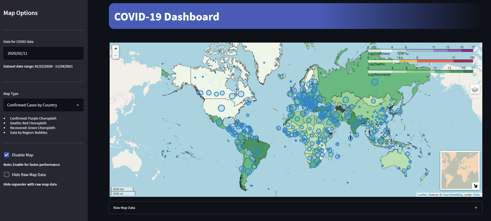
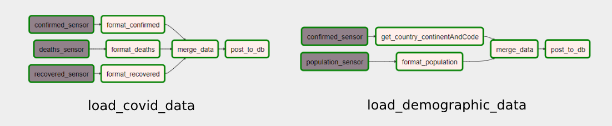
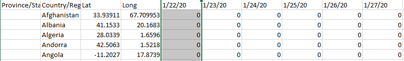
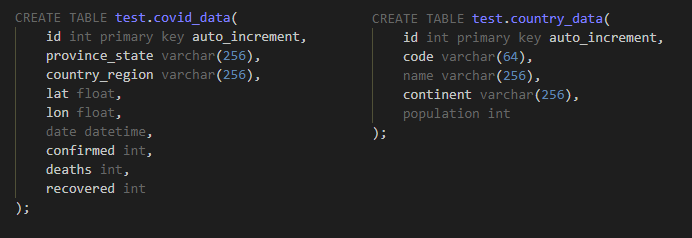

# YACD: Yet Another COVID-19 Dashboard

Yet another dashboard created to more easily visualize and explore the COVID-19 data available. The entire application is able to detect a group of specific CSVs (placed inside the 'monitor' folder), process the available data, store it in a central database and finally pull the data to display it in a visually appealing way. The dashboard allows the user to analyze the data in four distinct ways: A map, global statistics, continent-wise statistics and country-wise metrics.



-----

## Deployment

The dashboard can be deployed by cloning the repo, navigating to the local folder where it was cloned and finally running docker compose (a [standard installation of Docker](https://docs.docker.com/get-docker/) is required).

```sh
# Clone the repository
git clone git@github.com:eddysanoli-galileo/Product-Development.git

# Navigating to the corresponding folder
cd "./Proyectos/Proyecto 2/Dashboard"

# Starting the application (Docker is required)
docker-compose up
```

----

## App Components

The entire app is composed of four elements: An **Apache Airflow** webserver, a corresponding **Postgres** database for the Apache Airflow metadata, a central **MySQL** database for the COVID data itself, and finally, a **Streamlit** dashboard to display all the statistics and metrics. All the app files can be found inside the `Dashboard` directory.

<br><br>

### **Apache Airflow**

The apache Airflow webserver contains two DAGs (Directed Acyclic Graphs) by default: One to process the COVID data (`load_covid_data`), and one to process additional country and demographic data (`load_demographic_data`).



- `load_covid_data`: This DAG detects the presence of three separate CSV files located inside the `Dashboard/Monitor` directory, all through the use of file sensors:

  - Confirmed cases: `time_series_covid19_confirmed_global.csv`
  - Deaths: `time_series_covid19_deaths_global.csv`
  - Recovered cases: `time_series_covid19_recovered_global.csv`

  All sensors check for its corresponding file every 5 seconds, for a total of 60 seconds (a total of 12 checks). If no files were detected within the time limit, the sensor task will fail. If a file is detected, the data is then extracted and formatted to be more "database-friendly". All CSV files have a new column for each date registered, meaning that for each new day the database table would grow one column-a-day. 

  
  
  To prevent this, all three files are formatted to turn all the dates into a single "date" column. After this arrangement, the resulting dataframe grows from 281 rows, to more than 180k. Given that 3 different dataframes are generated, a merging phase is necessary (Left Join). The unified dataframe is then posted to the MySQL database through the use of SQL Alchemy.

- `load_demographic_data`: Similar to the COVID data DAG, this DAG senses two files: The file already used for the confirmed cases, and a country population file retrieved from the [World Bank](https://data.worldbank.org/indicator/SP.POP.TOTL) (`world_bank_population.csv`). The *confirmed cases* data is processed using the package PyCountry, in order to retrieve the ISO code and continent for each country present in the dataset. The *population* data is formatted similarly to the COVID data, but in this case, it is processed yearly, and due to the pandemic  beggining in 2020, only the 2020 population is used. The result is two dataframes: One with ISO codes and continents, and another with populations. Both are merged and posted to the MySQL database through SQL Alchemy.

**NOTES**: 

- All DAG scripts can be found inside `Dashboard/dags` as Python scripts. Both execute automatically once a day. 
- To send data between tasks, the XCOM module of Airflow is used.
- All data insertions into the database are preceded by a deletion of all the previous data.
- The base Docker files used to create the webserver, internal database and central MySQL database was provided by [obedaeg](https://github.com/obedaeg/airflow). However, this image tended to lose all of its connections (connection to the MySQL database and to the local file system) when the user used `docker-compose down`. To solve this, additional environment variables were passed to the webserver service inside `docker-compose.yml`. This creates the connections on launch, **even though they don't appear inside the connections tab in Apache Airflow**.

  ```yaml
  webserver:
        build: .
        restart: always
        depends_on:
            - postgres
        environment:
            - LOAD_EX=n
            - EXECUTOR=Local
            - AIRFLOW__CORE__FERNET_KEY=ZmDfcTF7_60GrrY167zsiPd67pEvs0aGOv2oasOM1Pg=
            - AIRFLOW_CONN_MYSQL_DEFAULT=mysql://test:test123@db:3306/test
            - AIRFLOW_CONN_FS_DEFAULT=file://:@:/?path=%2Fhome%2Fairflow%2Fmonitor
  ```
  It is worth mentioning that the `AIRFLOW_CONN_FS_DEFAULT` variable, uses a URI, meaning that the sequence `%2F`, actually consists of a backslash character.

<br><br>

### **MySQL Database**

The data extracted with the Apache Airflow DAGs, is placed inside a two-table MySQL database. The schemas for both tables mirrors the columns found in the resulting dataframes of the previous ETL step. Though not ideal, the country name was established as the link between both tables. 

The schema for both tables can be edited by altering the file `Dashboard/script/schema.sql`.



<br><br>

### **Streamlit Dashboard**

Due to Airflow using Python as a base for its tasks, Streamlit was used to build the dashboard, as it is also Python based. The dockerfile used as a base to build the Streamlit image was taken from [domoritz](https://github.com/domoritz/streamlit-docker/blob/master/Dockerfile). Said image was modified to increase the max size of embedded elements and include a `config.toml` file (found inside `Dashboard/streamlit`) to create a default theme for the app. 

The dashboard starts by merging the data from both database tables using the following query:

```sql
SELECT covd.*, coud.continent, coud.population, coud.code
FROM covid_data covd
LEFT JOIN country_data coud ON coud.name = covd.country_region
```

Due to the query taking a couple of seconds to execute, the resulting dataframe is cached in order to prevent the query from executing each time the dashboard is reloaded (every time a new option is selected).

After this, the dashboard uses this information inside four distinct sections:

- Map: Uses the data and the currently selected date to display 2 different types of maps: Choropleth maps and markers, both making use of the *Folium* package (a wrapper for *Leaflet.js*). 
  - **Choropleth maps**, or a colored maps, are maps that color a country in a stronger shade of color if they have a higher metric associated with it. Three variations are available: One for confirmed cases (shades of purple), one for deaths (shades of red) and one for recovered cases (shades of green). These maps require a specific type of JSON file, called GeoJSON, in order to load the country borders. Two GeoJSONs are provided: One in high resolution (`countries.geojson`), and one in low resolution (`countries-min.json`). Both can be used by altering line 249 of `Dashboard/streamlit/functions.py`, however, the high resolution borders lead to a pretty sharp increase in loading times (up to 30 seconds for each map).
  

  - **Markers** consist of bubbles that grow according to the number of confirmed cases in a region. Due to the GeoJSON data not containing geographic information for states and provinces, markers or bubbles are used to display data for areas smaller than a country. 

- Global Situation: The data is summarized in its entirety, by grouping the data only by date. This removes distinctions between countries and states, leading to a more global view of the data. Simple metrics are presented, alongside the progression of the number of cases and deaths. The number of recovered people was omitted as many countries in the base CSV seemed to simply lack data for the last couple of months (reporting a 0 after previously reporting more than 10k recovered people). Due to this, the total number of recovered people was corrected to be the max value for each country, and then was added to get the total. Sequential data for confirmed cases and deaths can be sampled weekly or daily, and we can observe the difference or the cumulative progression.

- Continent Situation: Similar to the sequences in the previous section, this section gives the user the ability to visualize the progression of confirmed cases, deaths and incidence of cases (confirmed cases divided by the total population) but now broken down into continents. This way the user can see which continents have contributed more to increases in the total number of infected people. A bar chart is also provided in order to summarize the most recent statistics.

- Country Situation: The user can go even further and visualize all the previous data for a specific country, using the same options for difference and sampling frequency. Aside from this, a country comparison is presented. The user can compare the infection rate, death rate and incidence rate of up to 10 different countries. The colored bars are not representative of actual metrics, but they are all weighted in order 